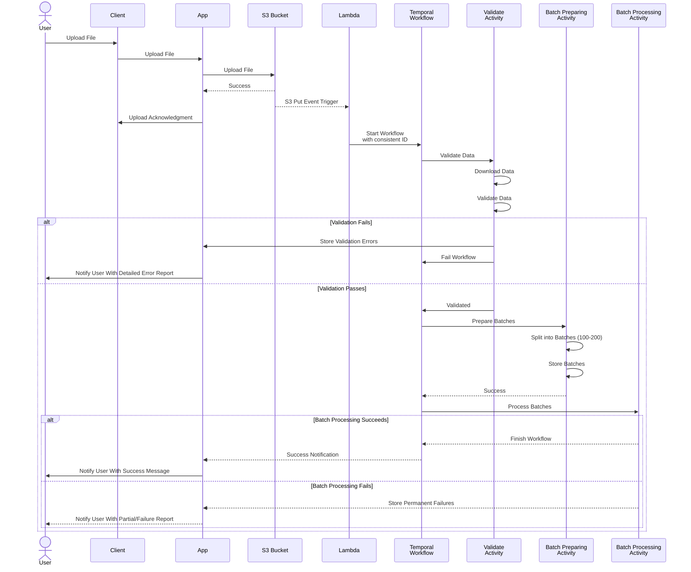

# Bulk Ingestion Solution

## 1. Upload & Acknowledgment
- **Expose an API** for bulk ingestion via file upload (CSV, JSON, etc.).
- **Upload the file to S3**, acknowledging the client that import has started.

## 2. Event-Driven Processing
- **Trigger a Lambda function** on the `PUT` event of the S3 bucket.
- **Start Temporal Workflow** with a consistent Workflow ID to prevent multiple parallel ingestion workflows.

## 3. Temporal Workflow
- **Implement a stateful workflow** for tracking progress, retries, and failure handling.

    ### 3.1. Validation Activity - Data Validation
    - Download data from S3 and validate IDs, duplicate records, missing parents, and circular references.
    - If validation fails, notify the user with a detailed error report and fail the workflow.

    ### 3.2. Batch Processing Strategy
    - **Batch Preparation Activity**:
        - Split records into **batches of 100-200** to optimize processing.
        - Store these batches.
    
    - **Batch Processing Activity**:
        - Process batches concurrently, but with a limit on parallel executions to **prevent memory overload**.
        - Use **exponential backoff and retries** for transient failures.

    - **Record Permanent Fail Activity**:
        - Store permanently failed records(S3).

>Ensure idempotency to prevent duplicate entries on retries.

# Heave Read Solution
- **Use indexing** on frequently queried fields (e.g., `parentId`).
